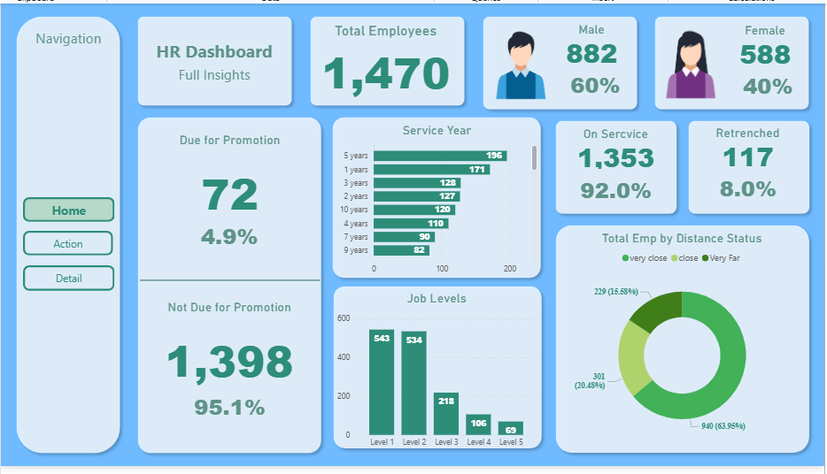
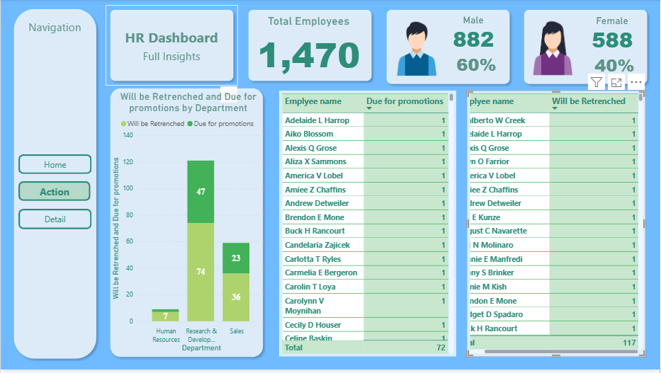
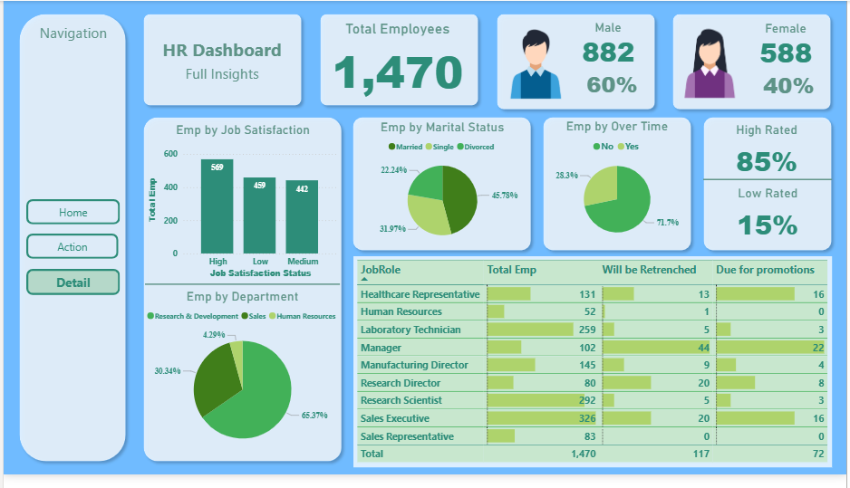

# 📊 HR Analytics Dashboard | Power BI

An interactive HR Analytics Dashboard built in **Microsoft Power BI** to help HR teams monitor workforce metrics, employee performance, promotions, attrition, and department-wise insights through dynamic visualizations.

---

## 📸 Dashboard Preview

### Executive Summary


### Employee Overview


### Employee Details


> **Note:** Update the image paths if your screenshots have different filenames.

---

# 📌 Project Objective

The goal of this dashboard is to provide HR managers and decision-makers with a complete overview of employee information, allowing them to:

- Monitor workforce size
- Analyze employee demographics
- Track promotions
- Identify employees at risk of retrenchment
- Measure job satisfaction
- Analyze department performance
- Support HR decision making using interactive dashboards

---

# 📂 Dataset

The dashboard is built using an HR employee dataset containing information such as:

- Employee ID
- Gender
- Age
- Department
- Job Role
- Marital Status
- Job Level
- Years at Company
- Distance from Home
- Job Satisfaction
- Promotion Status
- Attrition Status

---

# 📈 Dashboard Pages

## 1️⃣ Executive Summary

Provides a high-level overview of the organization.

### KPIs

- Total Employees
- Male Employees
- Female Employees
- High Rated Employees
- Low Rated Employees

### Visualizations

- Employee by Job Satisfaction
- Employee by Department
- Employee by Marital Status
- Employee Working Overtime
- Job Role Summary
- Employees Due for Promotion
- Employees Eligible for Retrenchment

---

## 2️⃣ Employee Overview

Focuses on employee lifecycle and workforce distribution.

### KPIs

- Due for Promotion
- Not Due for Promotion
- Employees in Service
- Retrenched Employees

### Visualizations

- Service Years
- Job Levels
- Distance Status
    - Very Close
    - Close
    - Very Far

---

## 3️⃣ Employee Details

Detailed employee-level information.

Includes:

- Employees Due for Promotion
- Employees Eligible for Retrenchment
- Department-wise comparison
- Employee tables with filtering and searching

---

# 📊 Key Insights

The dashboard enables users to quickly answer questions such as:

- How many employees are currently working?
- What is the male-to-female ratio?
- Which departments have the highest workforce?
- Which employees are due for promotion?
- Which employees are likely to be retrenched?
- How satisfied are employees with their jobs?
- Which job roles have the highest employee count?
- What is the employee distribution by service years?
- What percentage of employees work overtime?

---

# 🛠 Tools Used

- Microsoft Power BI Desktop
- Power Query
- DAX (Data Analysis Expressions)
- Data Modeling

---

# 📁 Repository Structure

```
HR_Dashboard/
│
├── dataset/
│   └── HR Dataset.xlsx
│
├── Pics/
│   ├── Executive Summary.png
│   ├── Employee Overview.png
│   └── Employee Details.png
│
├── HR Dashboard.pbix
│
└── README.md
```

---

# 🚀 Features

- Interactive dashboard
- Dynamic filtering
- KPI cards
- Department analysis
- Promotion tracking
- Retrenchment analysis
- Employee demographic insights
- Professional HR reporting

---

# 📷 Screens Included

- Executive Dashboard
- Employee Overview
- Employee Details

---

# 💡 Future Improvements

- Monthly hiring trends
- Attrition prediction using Machine Learning
- Salary analysis
- Diversity & Inclusion metrics
- Recruitment analytics
- Leave management dashboard
- Employee performance trends

---

# 👨‍💻 Author

**Kadhiravan Arasu**

Final Year B.Tech Information Technology Student

Passionate about Data Analytics, Power BI, SQL, Python, and Machine Learning.

---

## ⭐ If you found this project helpful, consider giving it a star!
